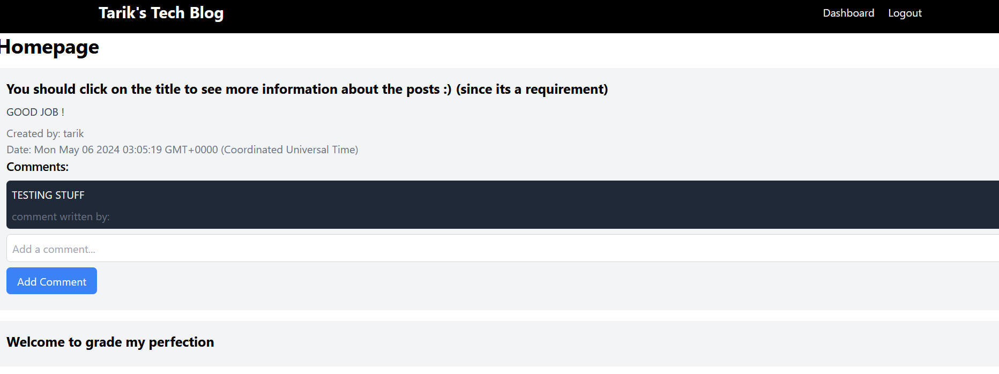
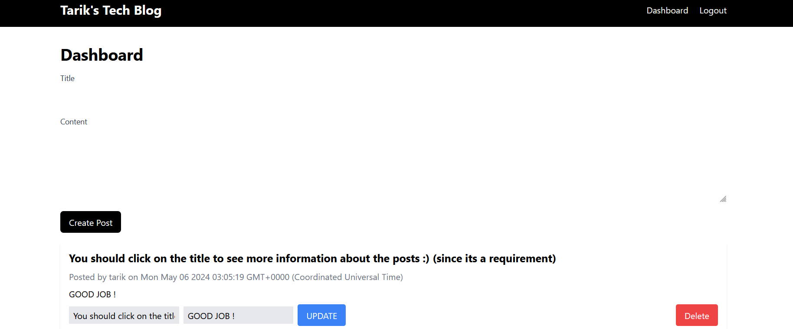

# mvc_tech_blog

## Muhsin Tarik Orgerim

  ## Table of Contents
  - [Description](#description)
  - [Usage](#usage)
  - [License](#license)
  - [Credits](#credits)
  - [Contribute](#contribute)
  

  ## Visuals
  
  
 

  # Description
  A server app that allows users to share their blog posts.

  ## Usage
  Can be used to share blogpost , check other users posts , comment , update/delete your own posts.

  ## Installation
  N/A

  ## Credits
  - Rutgers Bootcamp Resources.

  ## Contribute
  - Create a fork of the project
  - Create your branch
  - Make sure to commit your changes
  - Push the branch
  - Do a Pull Request

  ## Deployment
  - Link to my repo: https://github.com/tarikorg/mvc_tech_blog
  - Deployed link: [SERVER](https://boiling-caverns-39590-648518cd9cec.herokuapp.com/)
   
  ## Questions
  - Github username: https://github.com/tarikorg
  - Email: myku1771@gmail.com

  ## License
  This repository is under the MIT license.
